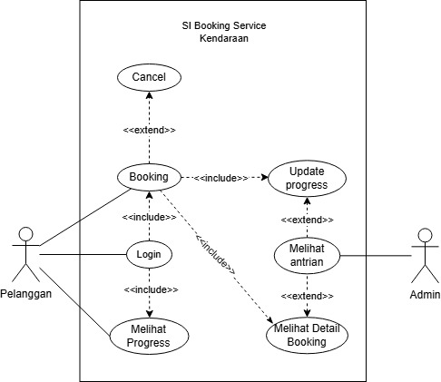

# Laporan Tugas APBO - Sistem informasi Booking Servis Kendaraan
Tugas Analisis Perancangan Berorientasi Objek - Kelas A Dosen: Adi Wahyu Pribadi, S.T M.T

## Nama Kelompok
| Nama | NIM |
|:-----|:-----|
|Abidzar Nur Wahid | 4522210123|
|Veruzi Fajrin | 4520210078|
|Kessya Immanuella Surbakti | 4522210137|
|Muhamad Diva Fahrizal | 4520210107|
|Gina Annisa R.A | 4522210154|

## 1. Indentitas Proyek.
  Proyek ini bertujuan untuk membangun sebuah Sistem Informasi Booking Servis Kendaraan
berbasis objek yang berfungsi mengotomatisasi proses penjadwalan antara pelanggan dan langsung
dari meja melalui pemindaian QR Code, meminimalisir antrean, serta memberikan kenyamanan bagi
pengguna. Selain itu, CafeEase membantu pemilik cafe mengelola pesanan agar lebih cepat, rapi, dan efisien.

## 2. Latar Belakang
Perkembangan teknologi informasi dan komunikasi yang semakin pesat telah memberikan dampak signifikan terhadap berbagai aspek kehidupan, termasuk dalam bidang bisnis dan pelayanan jasa.
Pemanfaatan sistem informasi menjadi salah satu solusi strategis dalam meningkatkan efisiensi, efektivitas, serta kualitas layanan kepada pelanggan. 
Dalam era digital saat ini, masyarakat cenderung menginginkan layanan yang cepat, mudah diakses, dan terintegrasi secara sistematis.

Sektor otomotif, khususnya layanan servis kendaraan, merupakan salah satu bidang yang memiliki tingkat permintaan yang tinggi seiring dengan meningkatnya
jumlah kendaraan bermotor setiap tahunnya. Kondisi ini menuntut penyedia jasa servis untuk mampu memberikan pelayanan yang optimal dan terorganisir.
Namun, pada praktiknya masih banyak bengkel yang menggunakan sistem konvensional dalam proses pemesanan layanan servis, seperti pelanggan harus datang langsung 
atau melakukan pemesanan melalui telepon.
Sistem konvensional tersebut memiliki berbagai keterbatasan, di antaranya adalah kurang efektifnya pengelolaan jadwal servis, potensi terjadinya antrean panjang, 
ketidakpastian waktu pelayanan, serta risiko kesalahan dalam pencatatan data pelanggan dan kendaraan. Selain itu, sistem manual juga menyulitkan dalam pengelolaan data historis 
servis kendaraan yang sebenarnya dapat dimanfaatkan untuk meningkatkan kualitas layanan dan pengambilan keputusan.

Dengan adanya permasalahan tersebut, diperlukan suatu sistem informasi yang mampu mengintegrasikan proses booking servis kendaraan secara terkomputerisasi. 
Sistem informasi booking servis kendaraan diharapkan dapat memberikan kemudahan bagi pelanggan dalam melakukan reservasi secara online tanpa harus datang langsung ke lokasi,
serta membantu pihak bengkel dalam mengelola jadwal servis, data pelanggan, dan informasi kendaraan secara lebih akurat dan terstruktur.
Penerapan sistem informasi ini juga diharapkan dapat meningkatkan efisiensi operasional, mengurangi waktu tunggu pelanggan,
serta meningkatkan kepuasan pelanggan terhadap layanan yang diberikan. Selain itu, sistem ini dapat menjadi sarana pendukung dalam pengambilan keputusan berbasis data, 
sehingga mampu meningkatkan daya saing usaha di bidang jasa servis kendaraan.

## 3. Identifikasi Masalah
  Dalam pelaksanaan pemesanan layanan servis kendaraan, masih banyak bengkel yang menerapkan metode konvensional, seperti pelanggan harus datang langsung atau melakukan pemesanan melalui telepon. Kondisi ini menimbulkan beberapa kendala, di antaranya:

- #### Proses pemesanan yang kurang efektif
  Pelanggan perlu meluangkan waktu dan tenaga lebih untuk melakukan booking secara langsung atau melalui komunikasi manual.

- #### Kesulitan dalam pengaturan jadwal
  Tanpa adanya sistem yang terintegrasi, sering terjadi tumpang tindih jadwal antar pelanggan.

- #### Minimnya keterbukaan informasi
  Informasi mengenai ketersediaan layanan, pilihan servis, serta estimasi waktu pengerjaan belum tersampaikan secara optimal.

- #### Pengelolaan data yang belum terstruktur
  Data pelanggan dan riwayat servis masih dicatat secara manual, sehingga rentan terhadap kehilangan dan kesulitan dalam pencarian data.

- #### Kurang optimalnya manajemen operasional
  Pihak bengkel mengalami kesulitan dalam mengatur antrian serta memantau proses layanan secara efisien.

Berdasarkan permasalahan tersebut, diperlukan suatu sistem informasi booking servis kendaraan berbasis online yang mampu meningkatkan efisiensi, mempermudah proses pemesanan, serta mendukung pengelolaan layanan yang lebih terorganisir.

## 4. ANALISIS KEBUTUHAN PENGGUNA
- #### Empathy Map
| User | Says | Thinks | Does | Feels |
|:-----|:-----|:-------|:-----|:------|
|**Pelanggan**| "Lelah menunggu jika sudah di bengkel tapi antrian panjang" | "Kalau bisa pilih jadwal dan memantau dari jarak jauh pasti lebih fleksibel dan sudah jelas kepastian nya" | "Menunggu antrian di bengkel atau kembali pulang" | "Lelah dan bosan menunggu antrian di bengkel" |
|**Admin/Pengelola**| "Sulit mengelola data pesanan dari whatsapp" | "Ingin sistem yang dapat menginput antrian otomatis" | "Mencatat manual antrian" | "Stress jika antrian tidak berjalan sesuai urutan" |

- #### Daftar Aktor
**Aktor 01 - Pelanggan :** Ingin sistem yang dapat memantau jadwal sekaligus progress dan dapat booking tanpa ke bengkel.
**Aktor 02 - Admin/Pengelola :** Membutuhkan sistem yang dapat menginput antrian otomatis dan menampilkan data antrian.

- #### Daftar Use Case
| Use Case | Deskripsi | Aktor |
|:-------- |:--------- |:----- |
|Booking | Pelanggan dapat melakukan booking dan harus login | Pelanggan |
|Cancel | Pelanggan dapat membatalkan booking | Pelanggan |
|Melihat Progress | Pelanggan dapat melihat progress pesanan service nya | Pelanggan |
|Melihat Antrian | Admin dapat melihat list ntrian | Admin |
|Update Progress | Admin dapat menginput progress apa saja yang sudah dilakukan dalam proses service | Admin |
|Melihat Detail Booking | Admin dapat melihat detail booking dari salah satu list antrian | Admin |

- #### Use Case Diagram

## 5. Saran pengguna

#### 1. Pemilik Kendaraan (Customer)

Pemilik kendaraan merupakan pengguna utama sistem yang menggunakan aplikasi untuk melakukan pemesanan layanan servis kendaraan tanpa harus datang langsung ke bengkel.
Melalui sistem ini, pemilik kendaraan dapat:

Melakukan registrasi dan login akun
Melihat informasi layanan servis yang tersedia
Melakukan booking jadwal servis kendaraan
Melihat status antrian atau jadwal servis
Mendapatkan notifikasi atau pengingat jadwal servis
Melihat riwayat servis kendaraan

Dengan adanya sistem ini, pemilik kendaraan dapat menghemat waktu dan menghindari antrian panjang di bengkel.

#### 2. Admin Bengkel

Admin bengkel bertugas mengelola seluruh data dan aktivitas yang ada dalam sistem. Admin memiliki peran penting dalam memastikan sistem berjalan dengan baik.
Beberapa tugas admin dalam sistem ini antara lain:

Mengelola data pengguna
Mengelola data layanan servis
Mengatur jadwal servis kendaraan
Mengelola data booking servis
Melihat dan membuat laporan servis

Admin menggunakan sistem untuk memastikan seluruh proses booking dan pelayanan berjalan dengan tertib dan terorganisir.

#### 3. Mekanik / Teknisi

Mekanik atau teknisi merupakan pengguna yang bertanggung jawab dalam melakukan proses servis kendaraan sesuai dengan jadwal yang telah dipesan oleh pelanggan.
Melalui sistem ini, mekanik dapat:

Melihat daftar kendaraan yang akan diservis
Melihat detail jenis servis yang diminta
Memperbarui status pengerjaan servis
Memberikan catatan hasil servis kendaraan

Dengan adanya sistem ini, mekanik dapat mengetahui pekerjaan yang harus dilakukan secara lebih terstruktur dan terjadwal.

## 6. Analisis Kebutuhan Sistem

- #### Kebutuhan Fungsional
Berdasarkan hasil wawancara, sistem yang dirancang diharapkan dapat:
1. Menyediakan layanan pemesanan servis secara online.
2. Menyimpan informasi pelanggan seperti nama, nomor telepon, jenis kendaraan, keluhan, serta jadwal servis.
3. Mengelola jadwal dan antrian servis secara otomatis.
4. Menghindari terjadinya konflik atau benturan jadwal.
5. Menampilkan kapasitas layanan servis setiap harinya.
6. Memberikan notifikasi atau konfirmasi kepada pelanggan terkait booking yang dilakukan.

- #### Kebutuhan Non-Fungsional
Sistem yang dikembangkan diharapkan memenuhi beberapa aspek berikut:
1. Memiliki tampilan yang mudah dipahami dan digunakan.
2. Memberikan kinerja yang cepat dan responsif.
3. Menjamin keamanan serta keakuratan data yang tersimpan.
4. Dapat diakses kapan saja tanpa batasan waktu.

- #### Kebutuhan Pengguna
1. Admin/Bengkel
- Bertanggung jawab dalam mengelola data booking, jadwal servis, serta data pelanggan.
2. Pelanggan
- Dapat melakukan pemesanan servis dan memilih jadwal yang tersedia sesuai kebutuhan.

## 7. ANALISIS AKTOR

#### 1. Pelanggan (Customer)
Pelanggan merupakan aktor utama yang menggunakan sistem untuk melakukan pemesanan layanan servis kendaraan.
Peran:
- Mengakses sistem untuk melakukan booking servis
- Mengelola data pribadi dan data kendaraan
- Melihat jadwal ketersediaan servis
- Memantau status booking
#### 2. Admin Sistem
Admin adalah pihak yang bertanggung jawab dalam mengelola sistem secara keseluruhan.
Peran:
- Mengelola data pengguna
- Mengatur jadwal servis
- Mengelola data layanan dan mekanik
- Memastikan sistem berjalan dengan baik
#### 3. Mekanik
Mekanik merupakan aktor yang melaksanakan proses servis kendaraan.
Peran:
- Melihat jadwal servis yang telah ditentukan
- Melakukan pekerjaan servis sesuai booking
- Memberikan update status pekerjaan
#### 4. Service Advisor 
Service Advisor bertindak sebagai penghubung antara pelanggan dan mekanik.
Peran:
- Mengonfirmasi booking pelanggan
- Mengelola komunikasi dengan pelanggan
- Menentukan estimasi waktu dan biaya servis
#### 5. Sistem Pembayaran (Payment Gateway)
Merupakan sistem eksternal yang menangani proses pembayaran (jika tersedia fitur pembayaran online).
Peran:
- Memproses transaksi pembayaran
- Memberikan konfirmasi pembayaran
#### 6. Sistem Notifikasi
Sistem eksternal yang digunakan untuk mengirim notifikasi kepada pengguna.
Peran:
- Mengirim pemberitahuan booking, pengingat jadwal, dan status servis

## 8. Analisis Perbandingan Sistem
|Proses | Sistem Lama | Sistem Baru |
|:--|:--|:--|
|Booking | Booking dengan menghubungi ke whatsapp bengkel | Booking melalui website bengkel dan dapat melihat langsung jadwal yang terisi |
|Monitoring Progress| Monitoring masih komunikasi lewat whatsapp | Dapat memonitor progress dan detail nya melalui website |
|Manajemen Antrian | Masih menggunakan catatan manual | Antrian di input otomatis |

## 9. Link vidio wawancara
https://youtu.be/hNwAWVdI3B8?si=8AMIQeuEv60Fx9Zi

## 10. Workflow Sistem Informasi Booking Servis Kendaraan

#### 1. Alur Booking oleh Pelanggan
Pelanggan membuka aplikasi / sistem booking
Pelanggan melakukan login / registrasi
Pelanggan memilih layanan servis
Pelanggan memasukkan data kendaraan
Pelanggan memilih tanggal & jam yang tersedia
Sistem mengecek ketersediaan jadwal
Jika tersedia → booking dikonfirmasi
Sistem menyimpan data booking dan menampilkan bukti booking (QR Code / kode booking)

#### 2. Alur Pengelolaan oleh Admin/Bengkel
Admin login ke sistem
Admin melihat daftar booking masuk
Admin melakukan validasi jadwal
Admin mengatur antrian servis
Admin menginput proses pengerjaan servis
Admin mengupdate status (Menunggu → Diproses → Selesai)
Sistem menyimpan riwayat servis

#### 3. Alur Saat Hari Servis
Pelanggan datang ke bengkel
Pelanggan melakukan check-in (scan QR / input kode)
Sistem memverifikasi data booking
Kendaraan masuk antrian servis
Mekanik melakukan servis
Setelah selesai → status diupdate
Pelanggan menerima notifikasi selesai

## Class Diagram

1. User
   merupakan kelas utama yang menjadi dasar bagi seluruh pengguna dalam sistem. Kelas ini menyimpan data umum pengguna seperti identitas, nama, email, nomor telepon, dan kata sandi, serta menyediakan fitur autentikasi berupa login dan logout.

2. Customer (Pelanggan)
   adalah pengguna yang memanfaatkan sistem untuk melakukan pemesanan layanan servis kendaraan. Pelanggan dapat mengajukan booking, membatalkan reservasi, melihat riwayat servis, dan memantau perkembangan pengerjaan kendaraan.

3. Admin
   berperan dalam mengelola dan mengawasi seluruh aktivitas sistem. Tugasnya meliputi pengelolaan data pengguna, layanan servis, data booking, serta penyusunan laporan operasional bengkel.

4. Mechanic (Mekanik)
   bertanggung jawab melaksanakan proses servis kendaraan sesuai jadwal yang tersedia. Mekanik juga dapat memperbarui status pengerjaan dan memberikan catatan terkait hasil servis.

5. Service Advisor
   berfungsi sebagai perantara antara pelanggan dan bengkel. Perannya mencakup konfirmasi booking, pemberian informasi estimasi biaya dan waktu pengerjaan, serta membantu komunikasi dengan pelanggan.

6. Vehicle (Kendaraan)
   digunakan untuk menyimpan informasi kendaraan milik pelanggan, seperti nomor kendaraan, merek, tipe, dan tahun pembuatan yang diperlukan dalam proses servis.

7. Service (Layanan Servis)
   Kelas Service menyimpan data mengenai jenis layanan yang disediakan bengkel, termasuk nama layanan, deskripsi, biaya, dan perkiraan durasi pengerjaan.

8. Booking
   merupakan kelas yang menangani proses reservasi servis kendaraan. Data yang dikelola meliputi jadwal servis, nomor antrian, keluhan pelanggan, dan status pemesanan.

9. Service Progress
    digunakan untuk mencatat dan memperbarui tahapan pengerjaan servis kendaraan sehingga perkembangan pekerjaan dapat dipantau dengan mudah.

10. Notification
    bertugas mengelola penyampaian informasi kepada pengguna, seperti konfirmasi booking, pengingat jadwal servis, dan pembaruan status pengerjaan.

11. Payment
    digunakan untuk mengelola transaksi pembayaran layanan servis, mencakup nominal pembayaran, metode yang digunakan, waktu transaksi, dan status pembayaran.

Class diagram yang dirancang menggambarkan struktur dan hubungan antarobjek dalam Sistem Informasi Booking Servis Kendaraan. Setiap kelas memiliki tanggung jawab yang berbeda namun saling terintegrasi untuk mendukung proses pemesanan servis, pengelolaan antrian, pemantauan progres pekerjaan, pengiriman notifikasi, hingga pengelolaan pembayaran. Dengan rancangan ini, sistem diharapkan mampu meningkatkan efektivitas operasional bengkel sekaligus memberikan kemudahan dan kenyamanan bagi pelanggan dalam memperoleh layanan servis kendaraan.

## Sequence Diagram

## Penjelasan

### Aktor
- Pelanggan
- Admin

### Alur Sistem

#### 1. Login
Pelanggan melakukan login melalui aplikasi Web/Mobile. Sistem memvalidasi kredensial ke database dan menampilkan beranda apabila berhasil.

#### 2. Booking Kendaraan
Pelanggan membuat booking layanan kendaraan. Data booking disimpan ke database dan sistem menampilkan detail booking.

#### 3. Pembatalan Booking
Pelanggan dapat membatalkan booking. Status booking akan diperbarui menjadi **Cancelled** pada database.

#### 4. Melihat Progress
Pelanggan dapat melihat progres pengerjaan kendaraan berdasarkan ID booking.

#### 5. Melihat Antrian (Admin)
Admin dapat melihat daftar antrian booking yang sedang diproses.

#### 6. Detail Booking (Admin)
Admin dapat melihat detail booking berdasarkan ID booking yang dipilih.

